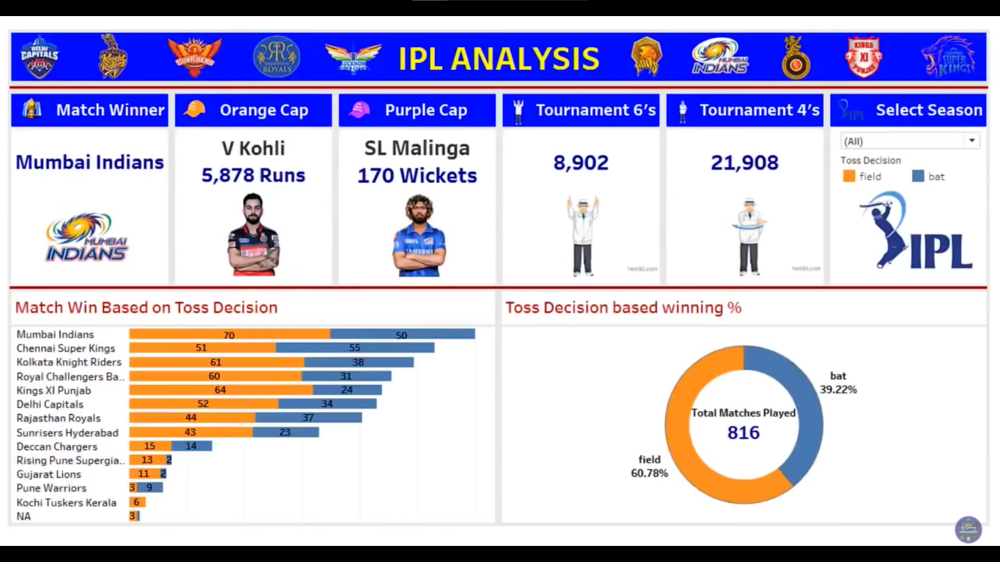
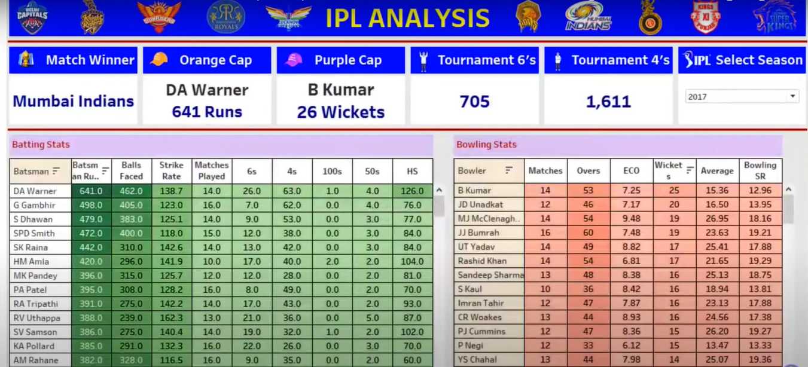

# 🏏 IPL Cricket Data Analytics Dashboard (Tableau)

This project is a **Tableau dashboard** built to explore and analyze **Indian Premier League (IPL)** data. It includes rich interactive visualizations covering match details, team stats, player performance, and trends across seasons.

---

## 📌 Key Features

- 🎯 Player-wise batting and bowling performance
- 🏆 Team vs Team comparisons and win ratios
- 📊 Venue-wise match insights and toss decisions
- 📅 Season trends and interactive filters for drill-down analysis

---

## 📷 Dashboard Snapshots

### 🏟️ 1. Match Summary Dashboard

---

### 👤 2. Player Performance Dashboard

---

### 🧬 3. Team Comparison & Head-to-Head Analysis

---

## 🧰 Tools Used

- **Tableau Public / Tableau Desktop**
- **IPL Dataset** in CSV/Excel format
- **Data Cleaning & Shaping** via Tableau Prep or in-app
- Filters, Parameters, and Custom Calculations

---

## 🚀 How to Use

1. Clone or download this repository  
2. Open the Tableau workbook (`.twb` or `.twbx`) in **Tableau Desktop**  
3. Ensure the dataset path is correct or reconnect if needed  
4. Interact with the dashboards via filters, dropdowns, and highlights

---

## 📦 Dataset Source

- Public IPL datasets from sources like:
  - [Kaggle IPL Datasets](https://www.kaggle.com/datasets)
  - [ESPN Cricinfo Stats](https://www.espncricinfo.com/)

---

## 📬 Contact Me

  

---

⭐ If you liked this project, please give it a star and share with fellow cricket fans!
